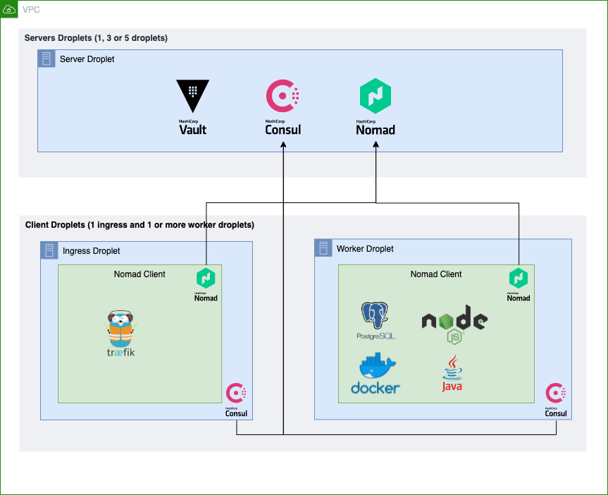

# Digital Ocean Hashicorp Cluster
This is a nice hosting stack for side projects
- Cheap hosting (About $20 per month)
- Easy deployment of the cluster infrastructure and applications running on it
- Dynamic Credentials
- Easy certificate management
- Understandable cluster architecture (Compared to K8S)
- Fun tools to use


## Architecture



  <h2>Architecture notes</h2>
  <h4>Services</h4> 
  <ul>
  <li><b>Consul:</b>
  <ul>
  <li>Service mesh</li>
  <li>Traefik has native integration with consul for discovering apps and removing / adding apps based on their health</li>
  </ul>
  </li>
  <li><b>Vault:</b>
  <ul>
  <li>Encrypted Key Value store for secrets</li>
  <li>Dynamic app secrets. Every time an app needs postgresql access it will receive a short lived username / password pair</li>
  </ul>
  </li>
  <li><b>Nomad:</b>
  <ul>
  <li>Nomad will be used to manage the apps we deploy</li>
  </ul>
  </li>
  <li><b>Traefik:</b>
  <ul>
  <li>Cloud native load balancer deployed on the public ingress node so that it is reachable from the internet</li>
  </ul>
  </li>
  </ul>
  <h4>Server Droplet</h4> 
  <ul>
  <li>Not publicly accessible</li>
  <li>Server instance of Consul</li>
  <li>Server instance of Vault</li>
  <li>Server instance of Nomad</li>
  </ul>
  <h4>Worker Droplet</h4> 
  <ul>
  <li>Not publicly accessible</li>
  <li>Client instance of Consul</li>
  <li>Client instance of Nomad</li>
  <li>The different kinds of services / apps / jobs you need to run. Examples are postgresql database, docker container, jar file or a node js app. All of them are managed by Nomad</li>
  </ul>
  <h4>Ingress Droplet</h4> 
  <ul>
  <li>Publicly accessible</li>
  <li>Client instance of Consul</li>
  <li>Client instance of Nomad</li>
  <li>Traefik managed by Nomad for ingress and certificate management</li>
  </ul>
  <h4>Tools used for deploying the architecture</h4> 
  <ul>
  <li>Docker (Consistent deployment environment)</li>
  <li>Terraform (Infrastructure)</li>
  <li>Packer (Creating immutable droplet images)</li>
  </ul>


## Deployment Prerequisites
- Docker
- DigitalOcean token
- 30 minutes

## Setup environment
There are quite a few tools used for deploying this architecture so it is therefore recommended to use docker for a consistent deployment environment.

```bash
# Build the docker image
docker build -t hashiplatform-deploy .
# Run the docker image and mount this repo into it. The ports are so that
# we can access the UI for Nomad, Vault, Consul, Traefik etc
docker run \
	-e DO_TOKEN="REPLACE_ME_WITH_DIGITAL_OCEAN_TOKEN"  \
	-p 4646:4646 -p 8081:8081 -p 8200:8200 -p 8500:8500 \
	-v $(pwd):/hashiplatform-deploy  \
	-it hashiplatform-deploy
# Move into project directory
cd hashiplatform-deploy
```

## Build the Droplet Image
Packer is the go-to tool for creating immutable machine images. We will use it to create
the image which our cluster droplets consists of.

```bash
cd image
packer init .
packer build .
cd ..
```

## Cluster infrastructure
We will use terraform to deploy the droplets, configure the firewall and vpc of the cluster. 

```bash
cd cluster
# Create SSH key to access droplets
ssh-keygen -q -t rsa -N '' -f ./id_rsa

# Create a space to hold your terraform state remotely
./create-backend.sh

# Init terraform
terraform init -backend-config=./backend.hcl

# Deploy droplets
terraform apply

# Create SSH tunnel into the server droplets so they can be accessed on localhost
# Remember that the server droplets are private so we need to tunnel through the ingress droplet
# to access them
./setup-tunnels.sh
cd ..
```

## Deploying some jobs on Nomad 
Lets use our newly created cluster and start by deploying Traefik and PostgreSQL

```bash
cd jobs
nomad run traefik.nomad
# You can now see traefik UI at localhost:8081 
nomad run postgres.nomad
cd ..
```

## Initializing Vault
Our app will need Vault secrets so we need to initialize and unseal Vault before it can be used. We will also manage all of the Vault configuration with Terraform.

```bash
cd vault

# Initialize and unseal vault cluster
./init-vault.sh

# Make sure the new environment variables set in init-vault script
# is sourced to our shell
source ~/.bashrc
export VAULT_TOKEN=$VAULT_TOKEN

# Init terraform
terraform init

# Configure Vault (adding policies, secret engines etc)
terraform apply
cd ..
```

## Connect Nomad and Vault 
Nomad needs a Vault token in order to query Vault for secrets that it can pass on to the jobs deployed on Nomad. This script will restart the Nomad servers with the Vault token generated in the
Terraform configuration for Vault in the previous step.

```bash
cd cluster
./connect_vault.sh
cd ..

```
## Deploying an app 
Lets now connect all the pieces together by deploying a app on Nomad that fetches dynamic PostgreSQL credentials from Vault and is exposed publicly by Traefik.

The app will be available at http://FLOATING_IP:80, you can find the floting IP from the cluster terraform output or in the digitalocean ui. The app will show you the secrets it has received and also let you make DB queries.

```bash
cd jobs
nomad run app.nomad
cd ..
# Optional: Get the floating ip
cd cluster
terraform output ingress_floating_ip
cd ..
```

## Adding HTTPS 
Traefik has really nice integration with lets encrypt and can manage your certificates (creation, renewal etc). These are the steps needed to activate HTTPS:
1. Point your domain to the floating ip created in the cluster terraform infrastructure
2. In `traefik.nomad` uncomment the `certificatesResolvers.myresolver.acme` section and add your own email.
3. In `app.nomad` your service tags should look like this (Remember to replace `YOUR_DOMAIN_NAME`):
```
	"traefik.enable=true",
	"traefik.http.routers.app.entryPoints=http,websecure",
	"traefik.http.routers.app.rule=Host(`YOUR_DOMAIN_NAME`)",
	"traefik.http.routers.app.tls.certResolver=myresolver",
```
